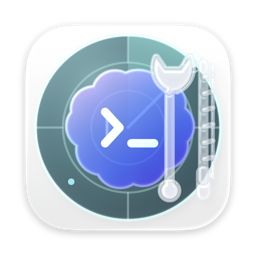
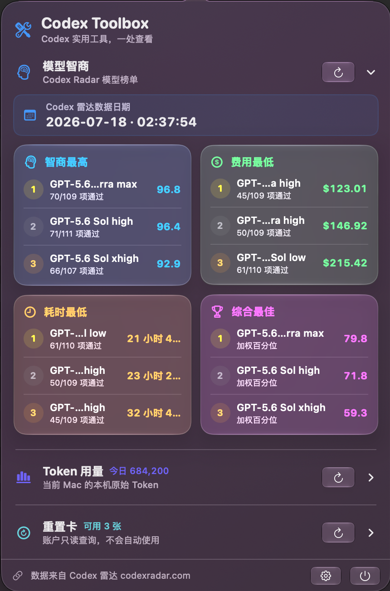
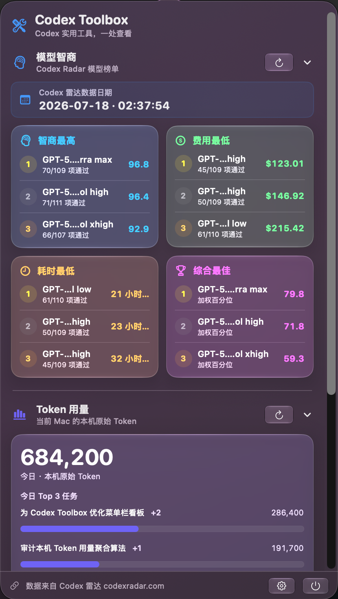

<div align="center">
  
  <h1>Codex Toolbox</h1>
  <p>把模型排名、本机 Token 用量与账户重置卡放进 macOS 菜单栏。</p>

  [](https://github.com/Digital-Twin-Technology-Laboratory/Codex-Toolbox/releases)
  [](#系统要求)
  [](https://www.swift.org/)
  [](LICENSE)
</div>

Codex Toolbox 是一款原生 macOS 菜单栏工具。它保留 Show Codex IQ 的模型智商、费用、耗时和综合排名，同时新增完全本机的 Token 审计与账户重置卡只读查询。三个模块各自刷新、各自缓存，任一数据源失败都不会清空其他结果。

> [!NOTE]
> **v1.0.0 预计正式发布时间：2026 年 7 月 20 日。** 目前尚未取得 Developer ID Application、Developer ID Installer 和 Apple 公证凭据。如果发布时仍未就绪，Gatekeeper 会影响安装体验；未通过签名与公证门禁的附件不会冒充正式包。

> [!IMPORTANT]
> 本项目与 OpenAI、ChatGPT 和 Codex 雷达均无官方隶属关系。模型排名来自 [codexradar.com](https://codexradar.com/)，详见[数据来源与授权说明](docs/data-source.md)。

## 应用预览

<p align="center">
  
  
</p>

## 三项核心功能

### 模型智商

- 完整保留四类榜单、前三/前五展开、趋势图、离线快照和权重综合排名。
- 菜单栏可切换智商、综合、费用或耗时，并支持序号、图标、详细数值和模型别名。
- 失败时继续展示最后一次成功数据，不会用空榜单覆盖有用状态。

### Token 用量

- 只读解析 `~/.codex/state_*.sqlite` 和本机 rollout JSONL，不调用模型，不上传任务内容。
- 展示今日本机原始 Token 总量、按根任务及其子任务聚合的 Top 3、其余任务和 7/14/30/90 天趋势；标题使用 Codex 在本机保存的具体对话或任务名称。
- 以累计 `total_token_usage.total_tokens` 去重，把 `last_token_usage.total_tokens` 按系统时区记账。`cached_input_tokens` 已属于 input，`reasoning_output_tokens` 已属于 output，不另行重复相加。
- 历史账本默认永久保留；源文件缺失或损坏时保留已记录数据并标记为“不完整”。

### 重置卡

- 通过已安装且登录的 Codex/ChatGPT 启动短生命周期 `codex app-server --listen stdio://`。
- 只请求 `account/rateLimits/read`，展示权威可用数量、最近过期时间和脱敏详情。
- 逐卡只缓存并展示发放时间和过期时间，统一转换为北京时间。
- 不保存或输出 access token、refresh token、cookie、说明文字或完整唯一 ID，永不发送 `account/rateLimitResetCredit/consume`。
- 未安装、未登录、超时或协议不兼容时给出可操作的恢复提示；有缓存时仍显示最后成功状态。

## 看板与设置

弹窗是一个连续的纵向看板。三个模块默认全部显示，Token 用量和重置卡默认折叠，折叠标题仍会直接显示今日 Token 总量与可用卡数。模块可隐藏、拖动排序或用键盘上移/下移。

设置页顺序为“通用&看板”、“智商显示”、“Token 用量”、“重置卡”和“关于”。通用页可调整模块顺序、登录启动，并可通过 GitHub 最新正式 Release 自动检查更新。

macOS 26+ 使用原生 Liquid Glass，macOS 14–15 回退为系统 Material。动效采用无弹跳的临界阻尼过渡；Reduced Motion 下只保留短交叉淡化。

## 安装与从 Show Codex IQ 升级

1. 从 [Releases](https://github.com/Digital-Twin-Technology-Laboratory/Codex-Toolbox/releases) 下载 PKG 或 DMG，并下载对应 `.sha256`。
2. 校验文件：

   ```bash
   shasum -a 256 -c Codex-Toolbox-1.0.0-universal.pkg.sha256
   # 或
   shasum -a 256 -c Codex-Toolbox-1.0.0-universal.dmg.sha256
   ```

3. **PKG（升级推荐）：**双击安装。它会在新应用验证成功后精确删除 `/Applications/Show Codex IQ.app`。
4. **DMG（手动拖拽）：**升级前先退出并删除“应用程序”中的 `Show Codex IQ.app`，再把 `Codex Toolbox.app` 拖入 Applications，避免新旧两个应用并存。DMG 内附中文升级说明。

Bundle ID 保持为 `io.github.zzzzzzjw.ShowCodexIQ`，因此原设置、榜单缓存与登录启动偏好可直接继承。PKG 会请求已运行的旧应用退出；新应用的目标路径、Bundle ID、签名与 Universal 2 架构全部验证成功后，才会删除精确路径 `/Applications/Show Codex IQ.app`。详见[升级与回滚说明](docs/upgrade-from-show-codex-iq.md)。

> [!WARNING]
> 不要对非官方、未签名或未公证的 PKG 绕过 Gatekeeper。仓库中的本地开发包只用于测试，不是可发布产物。

## 系统要求

- macOS 14.0 或更高版本
- Apple Silicon 或 Intel Mac（Universal 2）
- 模型排名需要访问 `https://codexradar.com/current.json`
- Token 模块需要当前 Mac 上可读取的 Codex 本地数据
- 重置卡模块需要已安装并登录的 Codex 或 ChatGPT；其他模块不受影响

## 数据与隐私

Token 数字仅代表当前 Mac 仍可读取的“本机原始 Token”，不等于 API 账单、账户套餐限额或余额百分比。归档或删除的 rollout 可能造成历史不完整。

应用级数据存放在：

```text
~/Library/Application Support/CodexToolbox/
```

首次启动会验证后把 `Application Support/ShowCodexIQ/latest.json` 复制到新目录，v1.0.0 不删除旧文件，便于回滚。更完整的边界见[隐私说明](docs/privacy.md)。

## 本地开发

项目使用 SwiftUI、AppKit `NSStatusItem`、Swift Charts、Observation、URLSession、SQLite3 和 ServiceManagement，不含第三方运行时依赖。Xcode 工程由 [XcodeGen](https://github.com/yonaskolb/XcodeGen) 生成。

```bash
brew install xcodegen
xcodegen generate
open CodexToolbox.xcodeproj
```

核心和完整 Xcode 测试：

```bash
DEVELOPER_DIR=/Applications/Xcode-beta.app/Contents/Developer \
xcrun --toolchain com.apple.dt.toolchain.XcodeDefault swift test \
  --scratch-path /tmp/codex-toolbox-spm

DEVELOPER_DIR=/Applications/Xcode-beta.app/Contents/Developer \
xcrun --toolchain com.apple.dt.toolchain.XcodeDefault swift run \
  --scratch-path /tmp/codex-toolbox-spm CoreVerification

DEVELOPER_DIR=/Applications/Xcode-beta.app/Contents/Developer \
TOOLCHAINS=com.apple.dt.toolchain.XcodeDefault \
xcodebuild -project CodexToolbox.xcodeproj -scheme CodexToolbox \
  -destination 'platform=macOS' CODE_SIGNING_ALLOWED=NO test
```

### PKG / DMG 构建、签名与公证

`scripts/build_pkg.sh` 在没有证书时会生成 ad-hoc 应用签名和未签名的本地测试 PKG。正式发布必须使用两类独立证书重建：

```bash
APP_SIGN_IDENTITY='Developer ID Application: ...' \
INSTALLER_SIGN_IDENTITY='Developer ID Installer: ...' \
bash scripts/build_pkg.sh

NOTARY_PROFILE='codex-toolbox-notary' \
bash scripts/notarize_pkg.sh

APP_SIGN_IDENTITY='Developer ID Application: ...' \
bash scripts/build_dmg.sh

NOTARY_PROFILE='codex-toolbox-notary' \
bash scripts/notarize_dmg.sh
```

证书和公证凭据只存在钥匙串，不写入脚本、环境文件或仓库。PKG 和 DMG 都必须签名、公证并 staple 后才能进入普通（非 Pre-release）GitHub Release。详见[发布指南](docs/releasing.md)与 [DMG 安装说明](docs/distribution/dmg-legacy.md)。

## OpenAI Build Week 项目沿革

Codex Toolbox 的前身 **Show Codex IQ** 在 OpenAI Build Week 期间是一个可运行的菜单栏模型榜单原型。仓库保留了用户原有的提交资料与人机协作记录：

- **Pre-period baseline:** 前六个提交，截止 `fb4219f`，包含初始骨架、排名/缓存核心、最初的菜单栏 UI 和打包。
- **In-period extension:** 后续工作增加了三段式权重、趋势、自适应弹窗与菜单栏、模型别名、开源文档、静态链接启动修复与端到端 DMG 验证。
- **Primary in-period `/feedback` Session ID:** `019f60dc-d23e-7ad2-84a2-a739947f1277`
- **Codex accelerated:** 功能实现、截图驱动的 UI 优化、测试、Universal 2 打包、已安装应用诊断和发布验证。
- **Human decisions:** 紧凑的两行菜单栏体验、用户可调的质量/成本/延迟权重、非破坏性失败行为，以及对界面与打包结果的审阅。

当时的[评委指南](docs/hackathon/judges-guide.md)和[完整提交包](docs/hackathon/README.md)作为历史资料继续保留，其中的 Show Codex IQ 名称与 DMG 命令反映当时版本。

## 参与贡献

欢迎提交 Issue 和 Pull Request。开始前请阅读 [CONTRIBUTING.md](CONTRIBUTING.md)，并确保核心验证器、Swift 测试与完整 Xcode 测试全部通过。

## 许可

项目代码采用 [MIT License](LICENSE)发布。第三方数据仍受其来源方条款约束。
